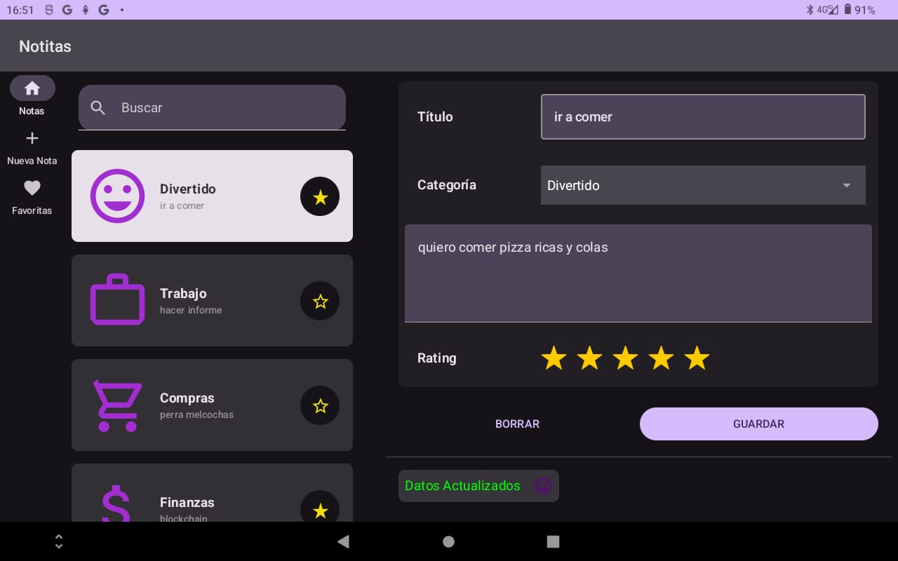

notitas app
==================================

Code of an app Android using:

- Build adaptive navigation
- Implement UI pattern with ListDetailPaneScaffold
- Room API with StateFlow
- Architecture components including ViewModel

-----------------------------------
This app allows you to store, modify and delete day-to-day notes

------------------------------------
# My CV here:
[Raúl Avilés Web Page](https://raulaviles.netlify.app/)

--------------------------------------
## Screenshots


--------------------------------------
## Coding of adaptative navigation
```kotlin
@Composable
private fun NavigationWrapperUI(
    uiState: NoteUIState,
    onValueChange: (String) -> Unit,
    onNoteClick: (Note) -> Unit,
    onNoteChange: (Note) -> Unit,
    nameUIState: NameUIState,
    onUpdateNote: () -> Unit,
    onDelete: () -> Unit,
    uiStateFavorite: NoteUIState,
    onValueChangeFavorite: (String) -> Unit,
    onNoteClickFavorite: (Note) -> Unit,
    onNoteChangeFavorite: (Note) -> Unit,
    nameUiStateFavorite: NameUIState,
    onUpdateFavorite: () -> Unit,
    onDeleteFavorite: () -> Unit,
    onNoteAdd: (Note) -> Unit,
    entryViewModel: EntryViewModel,
    entryUIState: NoteUIState
){
    var selectedDestination : NoteDestination by remember {
        mutableStateOf(NoteDestination.Notes)
    }

    val windowSize = with(LocalDensity.current) {
        currentWindowSize().toSize().toDpSize()
    }
    val navLayoutType = if (windowSize.width >= WINDOW_WIDTH_LARGE) {
        // Show a permanent drawer when window width is large.
        NavigationSuiteType.NavigationDrawer
    } else {
        // Otherwise use the default from NavigationSuiteScaffold.
        NavigationSuiteScaffoldDefaults.calculateFromAdaptiveInfo(currentWindowAdaptiveInfo())
    }

    NavigationSuiteScaffold(
        navigationSuiteItems = {
            NoteDestination.entries.forEach {
                item(
                    label = { Text(text = stringResource(id = it.labelRes))},
                    icon = { Icon(imageVector = it.icon, contentDescription = stringResource(id = it.labelRes))},
                    selected = it == selectedDestination,
                    onClick = {selectedDestination = it}
                )
            }
        },
        layoutType = navLayoutType
    ) {
        when (selectedDestination) {
            NoteDestination.Notes -> NotesDestination(
                uiState = uiState,
                onValueChange = onValueChange,
                onNoteClick = onNoteClick,
                onNoteChange = onNoteChange,
                nameUIState = nameUIState,
                onUpdateNote = onUpdateNote,
                onDelete = onDelete,
            )
            NoteDestination.Add -> AddDestination(
                uiState = entryUIState,
                onNoteAdd = onNoteAdd,
                entryViewModel = entryViewModel,
                onNavigateToNotes = {selectedDestination = NoteDestination.Notes}
            )
            NoteDestination.Favorites -> NotesDestination(
                uiState = uiStateFavorite,
                onValueChange = onValueChangeFavorite,
                onNoteClick = onNoteClickFavorite,
                onNoteChange = onNoteChangeFavorite,
                nameUIState = nameUiStateFavorite,
                onUpdateNote = onUpdateFavorite,
                onDelete = onDeleteFavorite,
            )
        }
    }
}
```
